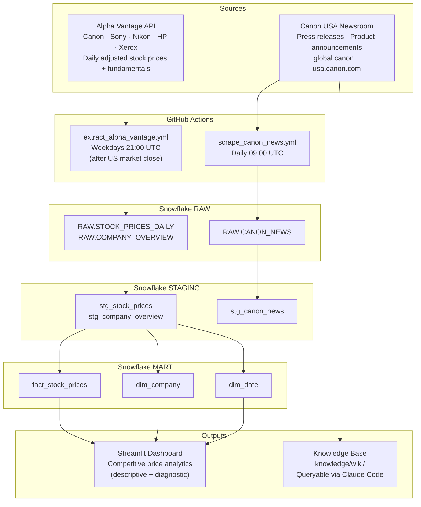

# Business Analytics Portfolio Project

Portfolio project for ISBA 4715 (Analytics Engineering) demonstrating end-to-end data pipeline and analytics skills.

**Target Role:** Data Analytics Analyst at Canon U.S.A., Inc.

## Tech Stack

| Layer | Tool |
|-------|------|
| Data Warehouse | Snowflake |
| Transformation | dbt |
| Orchestration | GitHub Actions (scheduled) |
| Dashboard | Streamlit (Streamlit Community Cloud) |
| Knowledge Base | Claude Code |

## Data Pipeline Diagram



## Project Structure

```
├── docs/
│   ├── job-posting.pdf          # Canon USA Data Analytics Analyst posting
│   ├── proposal.md              # Project proposal and reflection
│   └── api-star-schema.md       # Star schema design (Alpha Vantage)
├── scripts/
│   ├── extract_alpha_vantage.py # API extraction → Snowflake RAW
│   └── scrape_canon_news.py     # Web scrape → Snowflake RAW + knowledge/raw/
├── dbt/                         # dbt project (Milestone 02)
├── streamlit/                   # Dashboard app (Milestone 02)
├── knowledge/
│   ├── raw/                     # Scraped source documents
│   └── wiki/                    # Claude Code-generated wiki pages
├── .github/workflows/
│   ├── extract_alpha_vantage.yml # Automates stock data extraction
│   └── scrape_canon_news.yml    # Automates Canon news scrape
├── requirements.txt
└── .env.example                 # Documents required environment variables
```

## Setup

### 1. Clone and install dependencies

```bash
git clone https://github.com/JadenP1292/business-analytics-entertainment
cd business-analytics-entertainment
pip install -r requirements.txt
```

### 2. Configure environment variables

```bash
cp .env.example .env
# Edit .env with your credentials
```

Required variables (see `.env.example`):
- `ALPHA_VANTAGE_API_KEY` — free at [alphavantage.co/support/#api-key](https://www.alphavantage.co/support/#api-key) (any email accepted)
- `SNOWFLAKE_ACCOUNT`, `SNOWFLAKE_USER`, `SNOWFLAKE_PASSWORD`
- `SNOWFLAKE_WAREHOUSE`, `SNOWFLAKE_DATABASE`

### 3. Configure GitHub Secrets

Add all variables from `.env.example` as repository secrets under **Settings → Secrets and variables → Actions**.

### 4. Run pipelines manually

```bash
# Stock data extraction (Alpha Vantage → Snowflake RAW)
python scripts/extract_alpha_vantage.py

# Web scrape (Canon newsroom → Snowflake RAW + knowledge/raw/)
python scripts/scrape_canon_news.py
```

## Project Status

- [x] Proposal
- [x] Milestone 01: Extract & Load
- [ ] Milestone 02: Transform, Present & Polish
- [ ] Final Submission
