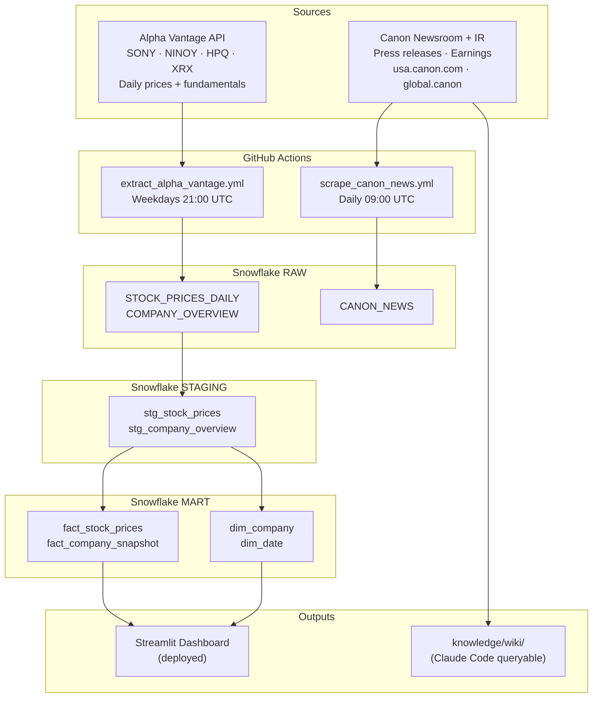
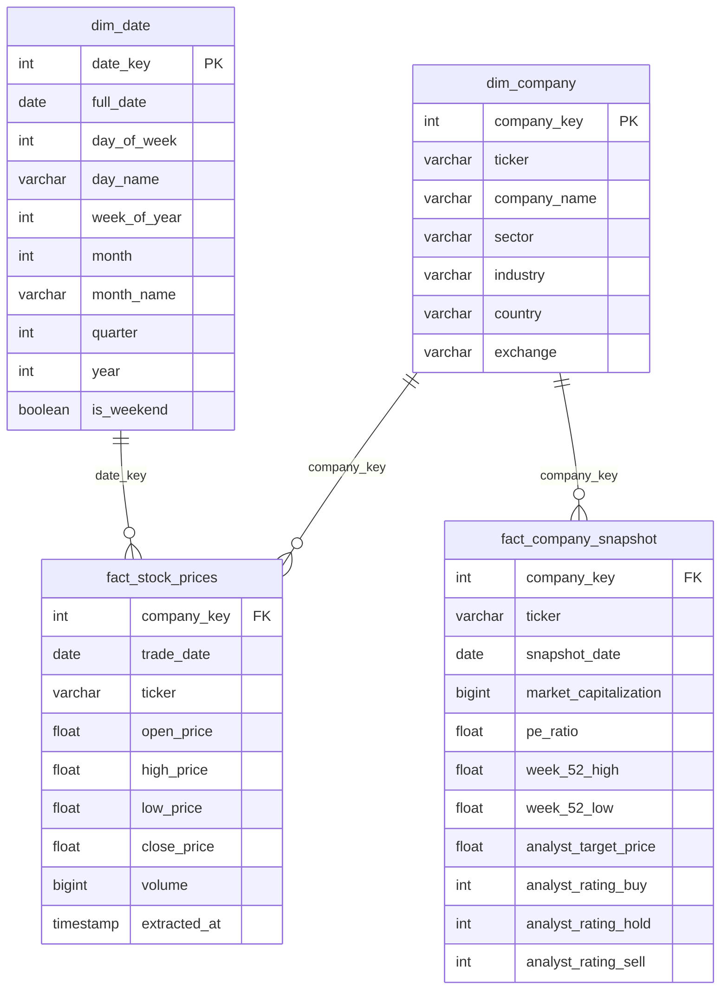
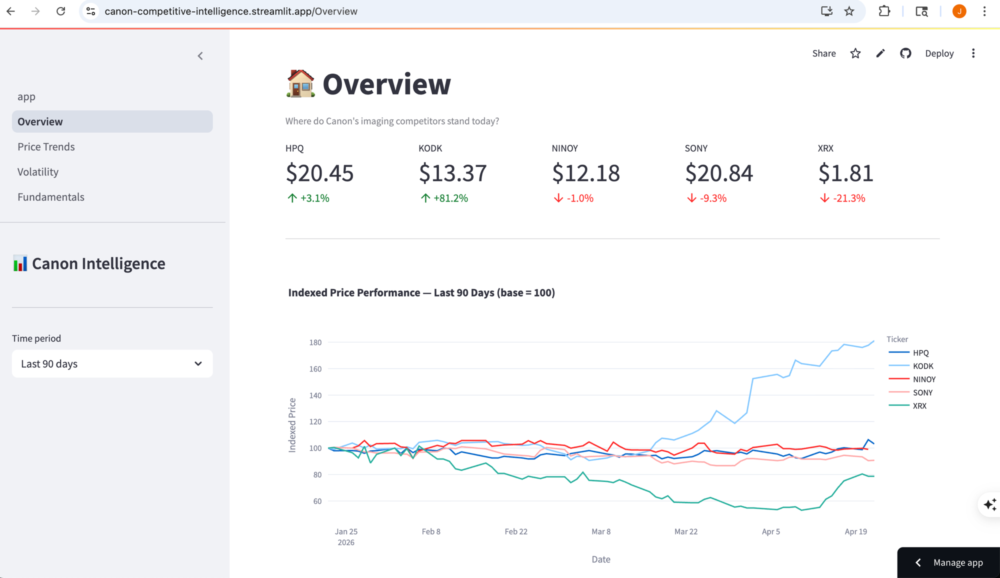

# Canon Competitive Intelligence

This project tracks daily stock performance and analyst sentiment for Canon's key imaging and document competitors — Sony, Nikon, HP, and Xerox — to demonstrate end-to-end analytics engineering skills relevant to the Data Analytics Analyst role at Canon U.S.A., Inc.

The pipeline extracts data via the Alpha Vantage API and Canon newsroom scraper, loads it into Snowflake, transforms it through dbt staging and mart layers, and surfaces competitive insights through a deployed Streamlit dashboard. A Claude Code-curated knowledge base synthesizes Canon IR and newsroom sources for qualitative context.

## Job Posting

**Role:** Data Analytics Analyst
**Company:** Canon U.S.A., Inc.

This project directly demonstrates the posting's core requirements: SQL for analytics (dbt models + mart queries), Python data pipelines (Alpha Vantage API + web scrapers), automated orchestration (GitHub Actions), and dashboard development (Streamlit) — applied to Canon's own competitive landscape.

## Tech Stack

| Layer | Tool |
|-------|------|
| Source 1 | Alpha Vantage REST API (stock prices + fundamentals) |
| Source 2 | Canon USA / Global newsroom + IR web scrape |
| Data Warehouse | Snowflake |
| Transformation | dbt |
| Orchestration | GitHub Actions (scheduled) |
| Dashboard | Streamlit (Streamlit Community Cloud) |
| Knowledge Base | Claude Code (scrape → summarize → query) |

## Pipeline Diagram



## ERD (Star Schema)



## Dashboard Preview



## Key Insights

**Descriptive (what happened?):** Review the Overview page after deployment — the normalized price chart shows relative performance across Sony, Nikon, HP, and Xerox over the selected period.

**Diagnostic (why did it happen?):** The Volatility page identifies which competitors showed the highest price swings and correlates with market events visible in the Canon newsroom knowledge base.

**Recommendation:** Canon should establish a quarterly competitor pricing monitor tracking XRX and HPQ discount patterns — early signals of enterprise printing price pressure before it reaches Canon's dealer channel.

## Live Dashboard

URL: https://canon-competitive-intelligence.streamlit.app/

## Knowledge Base

A Claude Code-curated wiki built from 21 scraped sources. Wiki pages live in `knowledge/wiki/`, raw sources in `knowledge/raw/`. Browse `knowledge/index.md` to see all pages.

Query it — open Claude Code in this repo and ask:
- "What are Canon's main business segments?"
- "How does Canon compete with Sony in cameras?"
- "What is Canon's strategic direction according to IR sources?"

Claude Code reads wiki pages first and falls back to raw sources. See `CLAUDE.md` for query conventions.

## Setup & Reproduction

**Requirements:** Python 3.12+, Snowflake trial account, Alpha Vantage API key (free at alphavantage.co)

```bash
git clone https://github.com/JadenP1292/business-analytics-entertainment
cd business-analytics-entertainment
pip install -r requirements.txt
cp .env.example .env   # fill in your credentials
```

Fill in `.env`:
```
SNOWFLAKE_ACCOUNT=hyc09383.us-east-1
SNOWFLAKE_USER=your_username
SNOWFLAKE_PASSWORD=your_password
SNOWFLAKE_DATABASE=BASKET_CRAFT
SNOWFLAKE_SCHEMA=RAW
SNOWFLAKE_WAREHOUSE=COMPUTE_WH
ALPHA_VANTAGE_API_KEY=your_key
```

**Run pipelines:**
```bash
python extract/extract_alpha_vantage.py
python extract/scrape_canon_news.py
python extract/scrape_canon_ir.py
cd dbt && dbt run --profiles-dir . && dbt test --profiles-dir .
cd ../streamlit && streamlit run app.py
```

## Repository Structure

```
.
├── .github/workflows/    # GitHub Actions pipelines
├── extract/              # Extraction scripts (API + scrapers)
├── dbt/                  # dbt project (staging + mart models)
├── streamlit/            # Streamlit dashboard app
├── knowledge/            # Knowledge base (raw sources + wiki pages)
├── docs/                 # Proposal, job posting, slides
├── .env.example          # Required environment variables
├── .gitignore
├── CLAUDE.md             # Project context + knowledge base query conventions
└── README.md
```
