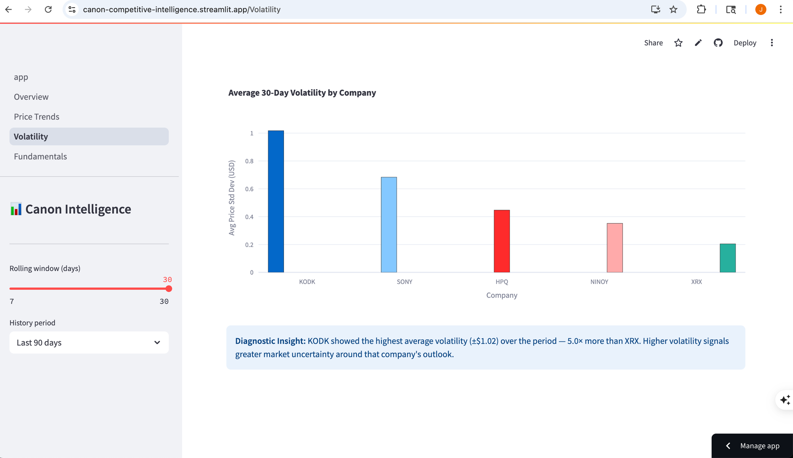
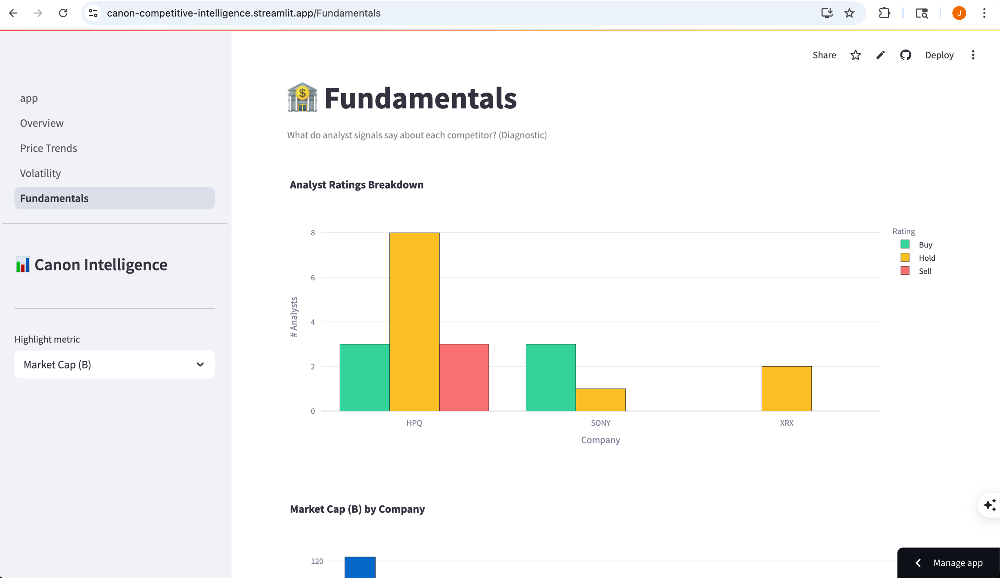

<!-- Slide 1: Descriptive -->

## Descriptive Insight

# KODK surged +81% while XRX fell −21% over the same 90-day period

Source: Alpha Vantage daily prices via Snowflake · canon-competitive-intelligence.streamlit.app

---

<!-- Slide 2: Diagnostic -->

## Diagnostic Insight

# KODK's price volatility was 5× higher than any imaging peer — signaling speculative, not fundamental, momentum

Root cause: KODK's spike reflects market speculation, not business fundamentals — Sony and HP show stable, low-volatility trends more relevant to Canon's competitive benchmarking.

---

<!-- Slide 3: Recommendation -->

## Recommendation

# Canon should run quarterly competitor pricing monitors on HPQ and XRX → detect enterprise discount pressure before it reaches the dealer channel

Rationale: HPQ carries the most mixed analyst signals (Buy + Hold + Sell) in the peer group, and XRX's $0.24B market cap signals structural weakness — both are likely sources of near-term pricing moves that could undercut Canon's document solutions business.
