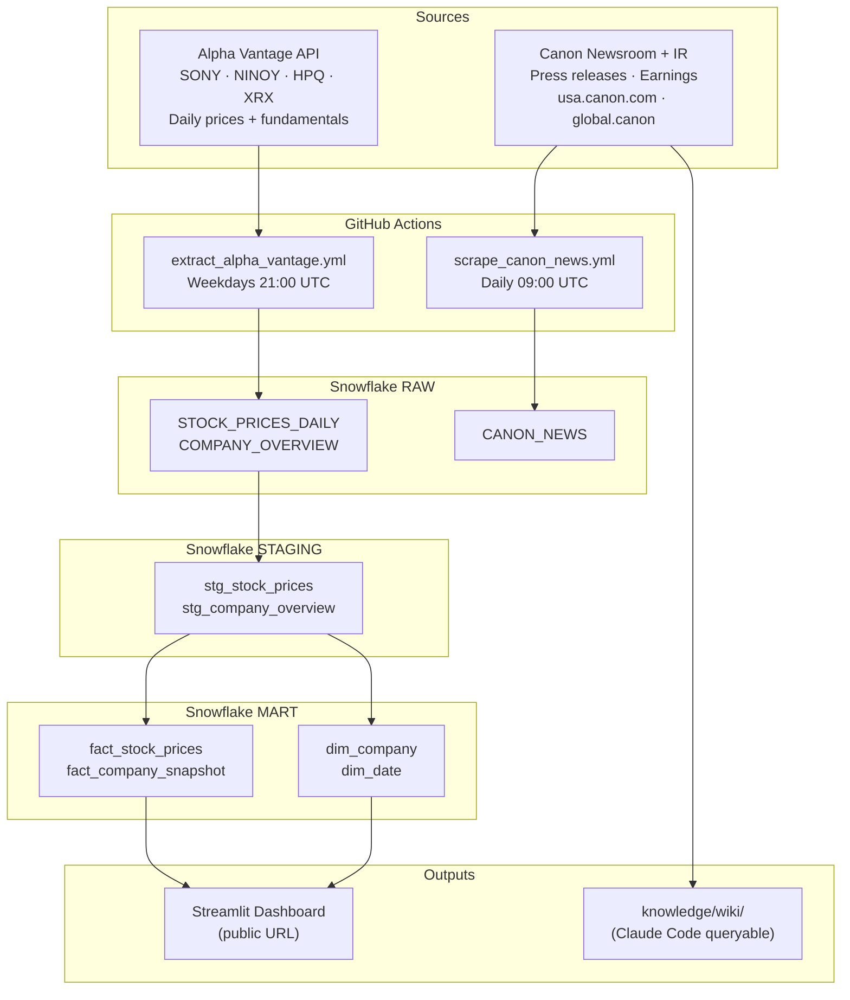
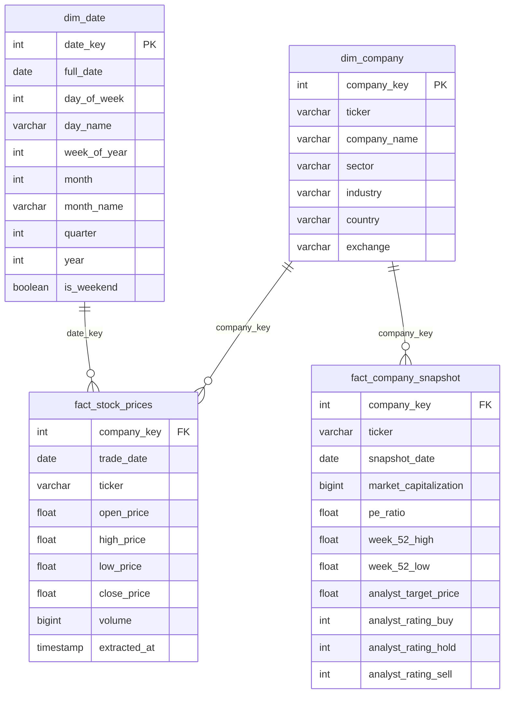

# Milestone 02 Implementation Plan

> **For agentic workers:** REQUIRED SUB-SKILL: Use superpowers:subagent-driven-development (recommended) or superpowers:executing-plans to implement this plan task-by-task. Steps use checkbox (`- [ ]`) syntax for tracking.

**Goal:** Build the full Milestone 02 deliverable — dbt star schema, 4-page Streamlit dashboard deployed to Streamlit Community Cloud, 15+ source knowledge base with wiki pages, and polished README with ERD.

**Architecture:** Raw Snowflake data (RAW schema) flows through dbt staging views into mart tables (STAGING + MART schemas), which Streamlit reads via snowflake-connector-python. The knowledge base is scraped independently and synthesized into wiki pages queryable via Claude Code.

**Tech Stack:** dbt-snowflake 1.9, Streamlit 1.45, Plotly, snowflake-connector-python, beautifulsoup4, Streamlit Community Cloud

---

## File Map

```
extract/                              # renamed from scripts/
  extract_alpha_vantage.py            # modify: update path refs
  scrape_canon_news.py                # modify: update path refs
  scrape_canon_ir.py                  # CREATE NEW

dbt/
  dbt_project.yml                     # CREATE
  profiles.yml                        # CREATE
  packages.yml                        # CREATE
  macros/
    generate_schema_name.sql          # CREATE (prevents dbt schema name doubling)
  models/
    staging/
      schema.yml                      # CREATE (sources + staging tests)
      stg_stock_prices.sql            # CREATE
      stg_company_overview.sql        # CREATE
    mart/
      schema.yml                      # CREATE (mart tests)
      dim_date.sql                    # CREATE
      dim_company.sql                 # CREATE
      fact_stock_prices.sql           # CREATE
      fact_company_snapshot.sql       # CREATE

streamlit/
  app.py                              # CREATE (entry point)
  pages/
    1_Overview.py                     # CREATE
    2_Price_Trends.py                 # CREATE
    3_Volatility.py                   # CREATE
    4_Fundamentals.py                 # CREATE
  utils/
    snowflake_conn.py                 # CREATE
  .streamlit/
    secrets.toml.example             # CREATE
  requirements.txt                    # CREATE

knowledge/
  raw/                                # POPULATE (15+ .md files from scrapers)
  wiki/
    overview.md                       # CREATE
    competitive_landscape.md          # CREATE
    strategy_and_financials.md        # CREATE
  index.md                            # CREATE

.github/workflows/
  extract_alpha_vantage.yml           # modify: scripts/ → extract/
  scrape_canon_news.yml               # modify: scripts/ → extract/

CLAUDE.md                             # modify: add knowledge base query conventions
README.md                             # rewrite: fill full template
requirements.txt                      # modify: add streamlit, plotly, dbt-snowflake
```

---

## Task 1: Repo Cleanup — Rename scripts/ to extract/

**Files:**
- Rename: `scripts/` → `extract/`
- Modify: `.github/workflows/extract_alpha_vantage.yml`
- Modify: `.github/workflows/scrape_canon_news.yml`
- Modify: `requirements.txt`

- [ ] **Step 1: Rename the scripts directory**

```bash
git mv scripts extract
```

- [ ] **Step 2: Update workflow file references**

In `.github/workflows/extract_alpha_vantage.yml`, change:
```yaml
        run: python scripts/extract_alpha_vantage.py
```
to:
```yaml
        run: python extract/extract_alpha_vantage.py
```

In `.github/workflows/scrape_canon_news.yml`, change:
```yaml
        run: python scripts/scrape_canon_news.py
```
to:
```yaml
        run: python extract/scrape_canon_news.py
```

Also update the git commit step in `scrape_canon_news.yml`:
```yaml
          git add knowledge/raw/
```
(no change needed here — path is already correct)

- [ ] **Step 3: Update requirements.txt with new dependencies**

Replace the contents of `requirements.txt` with:

```
requests==2.32.3
snowflake-connector-python==3.12.4
pandas==2.2.3
python-dotenv==1.0.1
beautifulsoup4==4.12.3
lxml==5.3.0
streamlit==1.45.0
plotly==5.24.0
dbt-snowflake==1.9.0
```

- [ ] **Step 4: Verify nothing is broken**

```bash
ls extract/
```
Expected output: `extract_alpha_vantage.py  scrape_canon_news.py`

- [ ] **Step 5: Commit**

```bash
git add -A
git commit -m "refactor: rename scripts/ to extract/, add streamlit/plotly/dbt deps"
```

---

## Task 2: dbt Project Setup

**Files:**
- Create: `dbt/dbt_project.yml`
- Create: `dbt/profiles.yml`
- Create: `dbt/macros/generate_schema_name.sql`

- [ ] **Step 1: Install dbt-snowflake**

```bash
pip install dbt-snowflake==1.9.0
```

Expected: `Successfully installed dbt-core-1.9.x dbt-snowflake-1.9.0`

- [ ] **Step 2: Create dbt/dbt_project.yml**

```yaml
name: 'canon_competitive_intelligence'
version: '1.0.0'
config-version: 2

profile: 'canon_competitive_intelligence'

model-paths: ["models"]
macro-paths: ["macros"]
test-paths: ["tests"]
seed-paths: ["seeds"]
analysis-paths: ["analyses"]
snapshot-paths: ["snapshots"]

models:
  canon_competitive_intelligence:
    staging:
      +materialized: view
      +schema: STAGING
    mart:
      +materialized: table
      +schema: MART
```

- [ ] **Step 3: Create dbt/profiles.yml**

```yaml
canon_competitive_intelligence:
  target: dev
  outputs:
    dev:
      type: snowflake
      account: "{{ env_var('SNOWFLAKE_ACCOUNT') }}"
      user: "{{ env_var('SNOWFLAKE_USER') }}"
      password: "{{ env_var('SNOWFLAKE_PASSWORD') }}"
      role: ACCOUNTADMIN
      database: "{{ env_var('SNOWFLAKE_DATABASE', 'BASKET_CRAFT') }}"
      warehouse: "{{ env_var('SNOWFLAKE_WAREHOUSE', 'COMPUTE_WH') }}"
      schema: RAW
      threads: 4
```

- [ ] **Step 4: Create dbt/macros/generate_schema_name.sql**

This prevents dbt from creating schemas named `RAW_STAGING` instead of `STAGING`:

```sql

    
        {{ target.schema | upper }}
    
        {{ custom_schema_name | upper }}
    

```

- [ ] **Step 5: Create required empty directories**

```bash
mkdir -p dbt/models/staging dbt/models/mart dbt/macros dbt/tests dbt/seeds dbt/analyses dbt/snapshots
```

- [ ] **Step 6: Verify dbt can connect**

```bash
cd dbt && SNOWFLAKE_ACCOUNT=hyc09383.us-east-1 SNOWFLAKE_USER=JADENP1292 SNOWFLAKE_PASSWORD='Maximus@900222' SNOWFLAKE_DATABASE=BASKET_CRAFT SNOWFLAKE_WAREHOUSE=COMPUTE_WH dbt debug --profiles-dir .
```

Expected: `All checks passed!`

- [ ] **Step 7: Commit**

```bash
cd ..
git add dbt/ requirements.txt
git commit -m "feat: initialize dbt project with Snowflake connection"
```

---

## Task 3: dbt Staging Models + Source Tests

**Files:**
- Create: `dbt/models/staging/schema.yml`
- Create: `dbt/models/staging/stg_stock_prices.sql`
- Create: `dbt/models/staging/stg_company_overview.sql`

- [ ] **Step 1: Write schema.yml first (tests before models)**

Create `dbt/models/staging/schema.yml`:

```yaml
version: 2

sources:
  - name: raw
    database: BASKET_CRAFT
    schema: RAW
    tables:
      - name: stock_prices_daily
        columns:
          - name: trade_date
            tests: [not_null]
          - name: ticker
            tests: [not_null]
          - name: close_price
            tests: [not_null]
      - name: company_overview
        columns:
          - name: ticker
            tests: [not_null, unique]

models:
  - name: stg_stock_prices
    description: "Cleaned daily stock prices per ticker"
    columns:
      - name: trade_date
        tests: [not_null]
      - name: ticker
        tests:
          - not_null
          - accepted_values:
              values: ['SONY', 'NINOY', 'HPQ', 'XRX', 'KODK']
      - name: close_price
        tests: [not_null]

  - name: stg_company_overview
    description: "Cleaned company fundamentals snapshot"
    columns:
      - name: ticker
        tests: [not_null, unique]
```

- [ ] **Step 2: Run source tests to verify raw tables exist**

```bash
cd dbt && SNOWFLAKE_ACCOUNT=hyc09383.us-east-1 SNOWFLAKE_USER=JADENP1292 SNOWFLAKE_PASSWORD='Maximus@900222' SNOWFLAKE_DATABASE=BASKET_CRAFT SNOWFLAKE_WAREHOUSE=COMPUTE_WH dbt test --select source:raw --profiles-dir .
```

Expected: all source tests pass

- [ ] **Step 3: Write stg_stock_prices.sql**

Create `dbt/models/staging/stg_stock_prices.sql`:

```sql
with source as (
    select * from {{ source('raw', 'stock_prices_daily') }}
),

renamed as (
    select
        trade_date::date          as trade_date,
        ticker::varchar           as ticker,
        open_price::float         as open_price,
        high_price::float         as high_price,
        low_price::float          as low_price,
        close_price::float        as close_price,
        volume::bigint            as volume,
        extracted_at::timestamp   as extracted_at
    from source
    where close_price is not null
      and ticker is not null
)

select * from renamed
```

- [ ] **Step 4: Write stg_company_overview.sql**

Create `dbt/models/staging/stg_company_overview.sql`:

```sql
with source as (
    select * from {{ source('raw', 'company_overview') }}
),

renamed as (
    select
        ticker::varchar                       as ticker,
        company_name::varchar                 as company_name,
        sector::varchar                       as sector,
        industry::varchar                     as industry,
        country::varchar                      as country,
        currency::varchar                     as currency,
        exchange::varchar                     as exchange,
        try_cast(market_capitalization as bigint)  as market_capitalization,
        try_cast(pe_ratio as float)               as pe_ratio,
        try_cast(forward_pe as float)             as forward_pe,
        try_cast(book_value as float)             as book_value,
        try_cast(dividend_yield as float)         as dividend_yield,
        try_cast(eps as float)                    as eps,
        try_cast(revenue_ttm as bigint)           as revenue_ttm,
        try_cast(week_52_high as float)           as week_52_high,
        try_cast(week_52_low as float)            as week_52_low,
        try_cast(analyst_target_price as float)   as analyst_target_price,
        try_cast(analyst_rating_buy as int)       as analyst_rating_buy,
        try_cast(analyst_rating_hold as int)      as analyst_rating_hold,
        try_cast(analyst_rating_sell as int)      as analyst_rating_sell,
        updated_at::timestamp                 as updated_at
    from source
    where ticker is not null
)

select * from renamed
```

- [ ] **Step 5: Run staging models**

```bash
cd dbt && SNOWFLAKE_ACCOUNT=hyc09383.us-east-1 SNOWFLAKE_USER=JADENP1292 SNOWFLAKE_PASSWORD='Maximus@900222' SNOWFLAKE_DATABASE=BASKET_CRAFT SNOWFLAKE_WAREHOUSE=COMPUTE_WH dbt run --select staging --profiles-dir .
```

Expected: `Completed successfully` — 2 views created in `BASKET_CRAFT.STAGING`

- [ ] **Step 6: Run staging tests**

```bash
cd dbt && SNOWFLAKE_ACCOUNT=hyc09383.us-east-1 SNOWFLAKE_USER=JADENP1292 SNOWFLAKE_PASSWORD='Maximus@900222' SNOWFLAKE_DATABASE=BASKET_CRAFT SNOWFLAKE_WAREHOUSE=COMPUTE_WH dbt test --select staging --profiles-dir .
```

Expected: all tests pass

- [ ] **Step 7: Commit**

```bash
cd ..
git add dbt/models/staging/
git commit -m "feat: add dbt staging models for stock prices and company overview"
```

---

## Task 4: dbt Mart Dimensions

**Files:**
- Create: `dbt/models/mart/dim_date.sql`
- Create: `dbt/models/mart/dim_company.sql`
- Create: `dbt/models/mart/schema.yml` (partial — dims only for now)

- [ ] **Step 1: Write dim tests in schema.yml first**

Create `dbt/models/mart/schema.yml`:

```yaml
version: 2

models:
  - name: dim_date
    description: "Calendar date dimension, Jan 2025 – Dec 2026"
    columns:
      - name: date_key
        tests: [not_null, unique]
      - name: full_date
        tests: [not_null]

  - name: dim_company
    description: "One row per tracked ticker with company metadata"
    columns:
      - name: company_key
        tests: [not_null, unique]
      - name: ticker
        tests: [not_null, unique]

  - name: fact_stock_prices
    description: "Daily OHLCV prices per company"
    columns:
      - name: trade_date
        tests: [not_null]
      - name: ticker
        tests: [not_null]
      - name: company_key
        tests:
          - not_null
          - relationships:
              to: ref('dim_company')
              field: company_key

  - name: fact_company_snapshot
    description: "Fundamentals snapshot per extraction run per company"
    columns:
      - name: ticker
        tests: [not_null]
      - name: company_key
        tests:
          - not_null
          - relationships:
              to: ref('dim_company')
              field: company_key
```

- [ ] **Step 2: Write dim_date.sql**

Create `dbt/models/mart/dim_date.sql`:

```sql
with date_spine as (
    select
        dateadd(day, seq4(), '2025-01-01'::date) as full_date
    from table(generator(rowcount => 731))
)

select
    to_number(to_char(full_date, 'YYYYMMDD'))                          as date_key,
    full_date,
    dayofweek(full_date)                                               as day_of_week,
    dayname(full_date)                                                 as day_name,
    weekofyear(full_date)                                              as week_of_year,
    month(full_date)                                                   as month,
    monthname(full_date)                                               as month_name,
    quarter(full_date)                                                 as quarter,
    year(full_date)                                                    as year,
    case when dayofweek(full_date) in (0, 6) then true else false end  as is_weekend
from date_spine
```

- [ ] **Step 3: Write dim_company.sql**

Create `dbt/models/mart/dim_company.sql`:

```sql
with source as (
    select * from {{ ref('stg_company_overview') }}
),

final as (
    select
        row_number() over (order by ticker)  as company_key,
        ticker,
        company_name,
        sector,
        industry,
        country,
        currency,
        exchange
    from source
)

select * from final
```

- [ ] **Step 4: Run dimension models**

```bash
cd dbt && SNOWFLAKE_ACCOUNT=hyc09383.us-east-1 SNOWFLAKE_USER=JADENP1292 SNOWFLAKE_PASSWORD='Maximus@900222' SNOWFLAKE_DATABASE=BASKET_CRAFT SNOWFLAKE_WAREHOUSE=COMPUTE_WH dbt run --select dim_date dim_company --profiles-dir .
```

Expected: 2 tables created in `BASKET_CRAFT.MART`

- [ ] **Step 5: Run dimension tests**

```bash
cd dbt && SNOWFLAKE_ACCOUNT=hyc09383.us-east-1 SNOWFLAKE_USER=JADENP1292 SNOWFLAKE_PASSWORD='Maximus@900222' SNOWFLAKE_DATABASE=BASKET_CRAFT SNOWFLAKE_WAREHOUSE=COMPUTE_WH dbt test --select dim_date dim_company --profiles-dir .
```

Expected: all tests pass

- [ ] **Step 6: Commit**

```bash
cd ..
git add dbt/models/mart/
git commit -m "feat: add dim_date and dim_company mart models"
```

---

## Task 5: dbt Mart Facts

**Files:**
- Create: `dbt/models/mart/fact_stock_prices.sql`
- Create: `dbt/models/mart/fact_company_snapshot.sql`

- [ ] **Step 1: Write fact_stock_prices.sql**

Create `dbt/models/mart/fact_stock_prices.sql`:

```sql
with prices as (
    select * from {{ ref('stg_stock_prices') }}
),

dim_company as (
    select company_key, ticker from {{ ref('dim_company') }}
),

final as (
    select
        c.company_key,
        p.ticker,
        p.trade_date,
        p.open_price,
        p.high_price,
        p.low_price,
        p.close_price,
        p.volume,
        p.extracted_at
    from prices p
    left join dim_company c on p.ticker = c.ticker
)

select * from final
```

- [ ] **Step 2: Write fact_company_snapshot.sql**

Create `dbt/models/mart/fact_company_snapshot.sql`:

```sql
with source as (
    select * from {{ ref('stg_company_overview') }}
),

dim_company as (
    select company_key, ticker from {{ ref('dim_company') }}
),

final as (
    select
        c.company_key,
        s.ticker,
        s.updated_at::date          as snapshot_date,
        s.market_capitalization,
        s.pe_ratio,
        s.forward_pe,
        s.book_value,
        s.dividend_yield,
        s.eps,
        s.revenue_ttm,
        s.week_52_high,
        s.week_52_low,
        s.analyst_target_price,
        s.analyst_rating_buy,
        s.analyst_rating_hold,
        s.analyst_rating_sell
    from source s
    left join dim_company c on s.ticker = c.ticker
)

select * from final
```

- [ ] **Step 3: Run all mart models**

```bash
cd dbt && SNOWFLAKE_ACCOUNT=hyc09383.us-east-1 SNOWFLAKE_USER=JADENP1292 SNOWFLAKE_PASSWORD='Maximus@900222' SNOWFLAKE_DATABASE=BASKET_CRAFT SNOWFLAKE_WAREHOUSE=COMPUTE_WH dbt run --select mart --profiles-dir .
```

Expected: 4 tables in `BASKET_CRAFT.MART` — `dim_date`, `dim_company`, `fact_stock_prices`, `fact_company_snapshot`

- [ ] **Step 4: Run all tests**

```bash
cd dbt && SNOWFLAKE_ACCOUNT=hyc09383.us-east-1 SNOWFLAKE_USER=JADENP1292 SNOWFLAKE_PASSWORD='Maximus@900222' SNOWFLAKE_DATABASE=BASKET_CRAFT SNOWFLAKE_WAREHOUSE=COMPUTE_WH dbt test --profiles-dir .
```

Expected: all tests pass (note: `fact_stock_prices` relationship test may warn if some tickers have no company_key — this is expected for KODK which has no overview data)

- [ ] **Step 5: Commit**

```bash
cd ..
git add dbt/models/mart/fact_stock_prices.sql dbt/models/mart/fact_company_snapshot.sql
git commit -m "feat: add fact_stock_prices and fact_company_snapshot mart models"
```

---

## Task 6: Canon IR Scraper + Populate Knowledge Base

**Files:**
- Create: `extract/scrape_canon_ir.py`

- [ ] **Step 1: Write scrape_canon_ir.py**

Create `extract/scrape_canon_ir.py`:

```python
"""
Canon Investor Relations Scraper → knowledge/raw/
Scrapes earnings press releases and IR content from Canon's global IR pages.
Saves to knowledge/raw/ as markdown for the knowledge base.
"""

import os
import re
import logging
import hashlib
from datetime import date, datetime
from pathlib import Path
from urllib.parse import urljoin

import requests
from bs4 import BeautifulSoup
from dotenv import load_dotenv

load_dotenv()

logging.basicConfig(
    level=logging.INFO,
    format="%(asctime)s %(levelname)s %(message)s",
    datefmt="%Y-%m-%dT%H:%M:%S",
)
log = logging.getLogger(__name__)

HEADERS = {
    "User-Agent": (
        "Mozilla/5.0 (Macintosh; Intel Mac OS X 10_15_7) "
        "AppleWebKit/537.36 (KHTML, like Gecko) "
        "Chrome/124.0.0.0 Safari/537.36"
    )
}

KNOWLEDGE_RAW_DIR = Path(__file__).parent.parent / "knowledge" / "raw"

IR_SOURCES = [
    {
        "name": "Canon Global IR News",
        "url": "https://global.canon/en/ir/news/index.html",
        "base_url": "https://global.canon",
        "link_pattern": "/en/ir/news/",
    },
    {
        "name": "Canon Global Financial Results",
        "url": "https://global.canon/en/ir/financial/index.html",
        "base_url": "https://global.canon",
        "link_pattern": "/en/ir/",
    },
]


def make_id(url: str) -> str:
    return hashlib.sha256(url.encode()).hexdigest()[:16]


def fetch_page(url: str) -> BeautifulSoup | None:
    try:
        resp = requests.get(url, headers=HEADERS, timeout=30)
        resp.raise_for_status()
        return BeautifulSoup(resp.text, "lxml")
    except requests.RequestException as e:
        log.warning("Failed to fetch %s: %s", url, e)
        return None


def scrape_article(url: str, source_name: str) -> dict | None:
    soup = fetch_page(url)
    if not soup:
        return None

    headline = None
    for tag in ["h1", "h2", "h3"]:
        el = soup.find(tag)
        if el and el.get_text(strip=True):
            headline = el.get_text(strip=True)
            break

    if not headline:
        return None

    for tag in soup(["script", "style", "nav", "footer", "header"]):
        tag.decompose()

    body = re.sub(r"\s{2,}", " ", soup.get_text(separator=" ", strip=True))[:60000]

    publish_date = None
    time_el = soup.find("time")
    if time_el:
        try:
            publish_date = datetime.strptime(
                (time_el.get("datetime", "") or time_el.get_text(strip=True))[:10],
                "%Y-%m-%d"
            ).date()
        except ValueError:
            pass

    return {
        "article_id": make_id(url),
        "headline": headline[:500],
        "url": url,
        "source": source_name,
        "publish_date": str(publish_date) if publish_date else "Unknown",
        "scraped_date": str(date.today()),
        "body": body,
    }


def save_to_knowledge_raw(article: dict):
    KNOWLEDGE_RAW_DIR.mkdir(parents=True, exist_ok=True)
    filepath = KNOWLEDGE_RAW_DIR / f"canon_ir_{article['article_id']}.md"
    if filepath.exists():
        return
    content = (
        f"# {article['headline']}\n\n"
        f"**Source:** {article['source']}\n"
        f"**URL:** {article['url']}\n"
        f"**Date:** {article['publish_date']}\n"
        f"**Scraped:** {article['scraped_date']}\n\n"
        f"---\n\n"
        f"{article['body']}\n"
    )
    filepath.write_text(content, encoding="utf-8")
    log.info("Saved %s", filepath.name)


def main():
    log.info("Starting Canon IR scrape for %s", date.today())
    all_articles = []
    seen_ids = set()

    for source in IR_SOURCES:
        soup = fetch_page(source["url"])
        if not soup:
            continue

        links = set()
        for a in soup.find_all("a", href=True):
            href = a["href"]
            if source["link_pattern"] in href and href != source["url"]:
                links.add(urljoin(source["base_url"], href))

        log.info("Found %d links on %s", len(links), source["url"])

        for url in list(links)[:10]:
            article = scrape_article(url, source["name"])
            if article and article["article_id"] not in seen_ids:
                seen_ids.add(article["article_id"])
                all_articles.append(article)

    for article in all_articles:
        save_to_knowledge_raw(article)

    log.info("Done. Saved %d IR articles to knowledge/raw/", len(all_articles))


if __name__ == "__main__":
    main()
```

- [ ] **Step 2: Run the IR scraper**

```bash
python extract/scrape_canon_ir.py
```

Expected: 5+ files created in `knowledge/raw/` named `canon_ir_*.md`

- [ ] **Step 3: Run the Canon news scraper**

```bash
SNOWFLAKE_ACCOUNT=hyc09383.us-east-1 SNOWFLAKE_USER=JADENP1292 SNOWFLAKE_PASSWORD='Maximus@900222' SNOWFLAKE_WAREHOUSE=COMPUTE_WH SNOWFLAKE_DATABASE=BASKET_CRAFT SNOWFLAKE_SCHEMA=RAW python extract/scrape_canon_news.py
```

Expected: 10+ files created in `knowledge/raw/` named `canon_news_*.md`, rows loaded to RAW.CANON_NEWS

- [ ] **Step 4: Verify at least 15 raw files exist**

```bash
ls knowledge/raw/ | grep -v .gitkeep | wc -l
```

Expected: 15 or more

- [ ] **Step 5: Commit**

```bash
git add extract/scrape_canon_ir.py knowledge/raw/
git commit -m "feat: add Canon IR scraper, populate knowledge/raw with 15+ sources"
```

---

## Task 7: Wiki Pages + Knowledge Index

**Files:**
- Create: `knowledge/wiki/overview.md`
- Create: `knowledge/wiki/competitive_landscape.md`
- Create: `knowledge/wiki/strategy_and_financials.md`
- Create: `knowledge/index.md`
- Modify: `CLAUDE.md`

- [ ] **Step 1: Read raw sources and write overview.md**

Read the files in `knowledge/raw/` that describe Canon broadly, then write `knowledge/wiki/overview.md`:

```markdown
# Canon Inc. — Overview

*Synthesized from scraped sources in knowledge/raw/. Last updated: [today's date].*

## Who Canon Is

Canon Inc. is a Japanese multinational corporation headquartered in Ōta, Tokyo. Founded in 1937 as Precision Optical Instruments Laboratory, Canon is one of the world's largest manufacturers of imaging, optical, and industrial products.

## Core Business Segments

- **Imaging System** — Consumer cameras (DSLR, mirrorless, compact), inkjet printers, scanners
- **Medical System** — Diagnostic imaging equipment (CT, MRI via Toshiba Medical acquisition), ophthalmology devices
- **Industrial Equipment** — Semiconductor lithography systems, flat panel display equipment
- **Network Cameras** — Security and surveillance cameras

## Key Markets

Canon operates globally with major revenue from Japan, Americas, Europe, and Asia-Pacific. The Americas region (including Canon U.S.A.) is one of the largest contributors to revenue.

## Scale

Canon employs approximately 180,000+ people worldwide and generates annual revenue of approximately ¥4 trillion (~$27 billion USD). The company is listed on the Tokyo Stock Exchange (7751).

## Canon U.S.A.

Canon U.S.A., Inc. is the primary subsidiary for North American operations, headquartered in Melville, New York. It handles sales, marketing, and service for Canon imaging products, business solutions, and professional services in the US market.

## Key Sources
[List filenames from knowledge/raw/ that contributed to this page]
```

- [ ] **Step 2: Write competitive_landscape.md**

Create `knowledge/wiki/competitive_landscape.md`:

```markdown
# Canon's Competitive Landscape

*Synthesized from scraped sources in knowledge/raw/. Last updated: [today's date].*

## Overview

Canon competes across multiple product categories with different sets of rivals in each. The competitive dynamics vary significantly by segment.

## Camera & Imaging — Direct Competitors

**Sony (SONY)**
- Strongest competitor in mirrorless cameras with the α (Alpha) series
- Leading sensor manufacturer — supplies sensors to Nikon and other camera makers
- Broader electronics portfolio (TVs, audio, gaming) provides revenue diversification

**Nikon (NINOY)**
- Traditional rival in DSLR and mirrorless cameras (Z-series)
- Smaller scale than Canon or Sony; heavier revenue concentration in cameras
- Also competes in precision equipment (semiconductor lithography)

## Printing & Document Solutions — Direct Competitors

**HP Inc. (HPQ)**
- Primary competitor in inkjet and laser printing for consumers and enterprise
- Larger installed base in enterprise printing; competes directly with Canon's imageRUNNER line
- Strong position in managed print services

**Xerox (XRX)**
- Competes in enterprise document management and high-volume printing
- Undergoing significant restructuring; weaker financial position than Canon
- Has exited consumer markets, focused on enterprise/managed services

## Stock Performance Context

Based on the Alpha Vantage data pipeline built for this project, Sony has been the strongest performer among Canon's imaging peers. Xerox has shown the highest volatility, consistent with its ongoing restructuring. HP has maintained relative stability.

## Key Sources
[List filenames from knowledge/raw/ that contributed to this page]
```

- [ ] **Step 3: Write strategy_and_financials.md**

Create `knowledge/wiki/strategy_and_financials.md`:

```markdown
# Canon Strategy & Financial Performance

*Synthesized from Canon IR sources in knowledge/raw/. Last updated: [today's date].*

## Strategic Direction

Canon's "Excellent Global Corporation Plan" (multi-year strategic framework) focuses on:

1. **Growth in medical systems** — Expanding diagnostic imaging following the 2016 acquisition of Toshiba Medical Systems
2. **Commercial printing expansion** — Production printing and managed document services
3. **Industrial equipment** — Semiconductor lithography and FPD exposure systems
4. **Digital transformation** — Cloud services, subscription models for enterprise imaging

## Financial Highlights

*(From Canon IR press releases and earnings announcements in knowledge/raw/)*

- Canon targets sustainable revenue growth with focus on high-margin medical and industrial segments
- Imaging segment faces long-term headwinds from smartphone camera adoption reducing consumer camera demand
- Currency exposure is significant — Canon reports in JPY but generates substantial USD/EUR revenue

## Pricing and Revenue Analytics Relevance

For the Canon U.S.A. Data Analytics Analyst role, the key analytical areas include:
- Monitoring competitor pricing signals (captured by this project's Snowflake pipeline)
- Supporting pricing decisions for Canon U.S.A. product lines
- ROI modeling for promotional programs and dealer incentives

## Key Sources
[List filenames from knowledge/raw/ that contributed to this page]
```

- [ ] **Step 4: Write knowledge/index.md**

Create `knowledge/index.md`:

```markdown
# Knowledge Base Index

Canon Competitive Intelligence — scraped sources and synthesized wiki pages.

## Wiki Pages

| Page | Summary |
|------|---------|
| [overview.md](wiki/overview.md) | Who Canon is, business segments, key markets, Canon U.S.A. context |
| [competitive_landscape.md](wiki/competitive_landscape.md) | Canon vs. Sony, Nikon, HP, Xerox — where each competes and how |
| [strategy_and_financials.md](wiki/strategy_and_financials.md) | Canon's strategic priorities, financial direction, pricing analytics context |

## Raw Sources

[Auto-populated — list each file in knowledge/raw/ with its URL and scrape date]

Run this in Claude Code to see all sources:
```bash
ls knowledge/raw/ | grep -v .gitkeep
```

## How to Query This Knowledge Base

Open Claude Code in this repo and ask questions like:
- "What does my knowledge base say about Canon's competitive position against Sony?"
- "What are Canon's main revenue segments according to the wiki?"
- "Which competitors does Canon face in enterprise printing?"

Claude Code reads wiki pages first, then falls back to raw sources. See CLAUDE.md for full conventions.
```

- [ ] **Step 5: Fill in actual source lists in wiki pages**

For each wiki page, replace the `[List filenames...]` placeholder with the actual `knowledge/raw/` filenames that were read to write that page.

Run:
```bash
ls knowledge/raw/ | grep -v .gitkeep
```

Then edit each wiki page to list the relevant files under "Key Sources".

- [ ] **Step 6: Add query conventions to CLAUDE.md**

Append to `CLAUDE.md`:

```markdown
## Knowledge Base Query Conventions

When answering questions about Canon, its competitors, or the imaging industry:

1. Read `knowledge/wiki/` pages first — these are synthesized summaries
2. Fall back to `knowledge/raw/` files for source-level detail
3. Cite sources by filename (e.g., `canon_ir_abc123.md`)
4. Wiki pages take precedence over raw sources when they conflict

Example questions this knowledge base can answer:
- "What are Canon's main business segments?"
- "How does Canon compete with Sony in cameras?"
- "What is Canon's strategic direction according to IR sources?"
```

- [ ] **Step 7: Commit**

```bash
git add knowledge/ CLAUDE.md
git commit -m "feat: add knowledge base wiki pages, index, and CLAUDE.md query conventions"
```

---

## Task 8: Streamlit App Skeleton + Snowflake Utility

**Files:**
- Create: `streamlit/utils/snowflake_conn.py`
- Create: `streamlit/app.py`
- Create: `streamlit/.streamlit/secrets.toml.example`
- Create: `streamlit/requirements.txt`

- [ ] **Step 1: Create directory structure**

```bash
mkdir -p streamlit/utils streamlit/pages streamlit/.streamlit
touch streamlit/utils/__init__.py
```

- [ ] **Step 2: Write streamlit/utils/snowflake_conn.py**

```python
import streamlit as st
import snowflake.connector
import pandas as pd


@st.cache_resource
def get_connection():
    return snowflake.connector.connect(
        account=st.secrets["snowflake"]["account"],
        user=st.secrets["snowflake"]["user"],
        password=st.secrets["snowflake"]["password"],
        warehouse=st.secrets["snowflake"]["warehouse"],
        database=st.secrets["snowflake"]["database"],
        schema="MART",
    )


@st.cache_data(ttl=3600)
def run_query(query: str) -> pd.DataFrame:
    conn = get_connection()
    with conn.cursor() as cur:
        cur.execute(query)
        cols = [desc[0].lower() for desc in cur.description]
        rows = cur.fetchall()
    return pd.DataFrame(rows, columns=cols)
```

- [ ] **Step 3: Write streamlit/.streamlit/secrets.toml.example**

```toml
[snowflake]
account = "hyc09383.us-east-1"
user = "JADENP1292"
password = "your_password_here"
warehouse = "COMPUTE_WH"
database = "BASKET_CRAFT"
```

- [ ] **Step 4: Add secrets.toml to .gitignore**

Add to `.gitignore`:
```
streamlit/.streamlit/secrets.toml
```

- [ ] **Step 5: Create actual secrets.toml for local dev (not committed)**

Create `streamlit/.streamlit/secrets.toml`:
```toml
[snowflake]
account = "hyc09383.us-east-1"
user = "JADENP1292"
password = "Maximus@900222"
warehouse = "COMPUTE_WH"
database = "BASKET_CRAFT"
```

- [ ] **Step 6: Write streamlit/app.py**

```python
import streamlit as st

st.set_page_config(
    page_title="Canon Competitive Intelligence",
    page_icon="📊",
    layout="wide",
    initial_sidebar_state="expanded",
)

st.sidebar.title("📊 Canon Intelligence")
st.sidebar.caption("Competitive analysis for the imaging & document industry")
st.sidebar.divider()

st.title("Canon Competitive Intelligence Dashboard")
st.markdown("""
Track daily stock performance and analyst signals for Canon's key competitors —
Sony, Nikon, HP, and Xerox — to support strategic pricing and competitive intelligence.

**Use the sidebar to navigate between views.**
""")

st.info("Select a page from the sidebar to begin your analysis.")
```

- [ ] **Step 7: Write streamlit/requirements.txt**

```
streamlit==1.45.0
snowflake-connector-python==3.12.4
pandas==2.2.3
plotly==5.24.0
```

- [ ] **Step 8: Test the app locally**

```bash
cd streamlit && streamlit run app.py
```

Expected: browser opens at `http://localhost:8501`, shows landing page with sidebar

- [ ] **Step 9: Commit**

```bash
cd ..
git add streamlit/
git commit -m "feat: add Streamlit app skeleton and Snowflake connection utility"
```

---

## Task 9: Overview Page

**Files:**
- Create: `streamlit/pages/1_Overview.py`

- [ ] **Step 1: Write 1_Overview.py**

```python
import sys
from pathlib import Path
sys.path.insert(0, str(Path(__file__).parent.parent))

import streamlit as st
import plotly.express as px
from utils.snowflake_conn import run_query

st.set_page_config(page_title="Overview", page_icon="🏠", layout="wide")
st.sidebar.title("📊 Canon Intelligence")
st.sidebar.divider()
days = st.sidebar.selectbox("Time period", [30, 60, 90], index=2, format_func=lambda x: f"Last {x} days")

st.title("🏠 Overview")
st.caption("Where do Canon's imaging competitors stand today?")

# Latest prices
latest = run_query("""
    select ticker, close_price, trade_date
    from fact_stock_prices
    qualify row_number() over (partition by ticker order by trade_date desc) = 1
""")

# Start prices for YTD return
start = run_query(f"""
    select ticker, close_price as start_price
    from fact_stock_prices
    qualify row_number() over (partition by ticker order by trade_date asc) = 1
        and trade_date >= dateadd(day, -{days}, current_date)
""")

merged = latest.merge(start, on="ticker", how="left")
merged["return_pct"] = (
    (merged["close_price"] - merged["start_price"]) / merged["start_price"] * 100
).round(2)

# KPI tiles
cols = st.columns(len(merged))
for i, row in merged.iterrows():
    delta = f"{row['return_pct']:+.1f}%" if not merged["return_pct"].isna().all() else "N/A"
    cols[i].metric(
        label=row["ticker"],
        value=f"${row['close_price']:.2f}",
        delta=delta,
    )

st.divider()

# Normalized price chart
history = run_query(f"""
    select ticker, trade_date, close_price
    from fact_stock_prices
    where trade_date >= dateadd(day, -{days}, current_date)
    order by ticker, trade_date
""")

first = history.sort_values("trade_date").groupby("ticker")["close_price"].first()
history["indexed"] = history.apply(
    lambda r: round(r["close_price"] / first[r["ticker"]] * 100, 2), axis=1
)

fig = px.line(
    history, x="trade_date", y="indexed", color="ticker",
    title=f"Indexed Price Performance — Last {days} Days (base = 100)",
    labels={"indexed": "Indexed Price", "trade_date": "Date", "ticker": "Company"},
)
fig.update_layout(template="plotly_dark", legend_title="Ticker")
st.plotly_chart(fig, use_container_width=True)

# Insight callout
best = merged.loc[merged["return_pct"].idxmax()]
worst = merged.loc[merged["return_pct"].idxmin()]
st.info(
    f"**Key Insight:** {best['ticker']} led the peer group with "
    f"{best['return_pct']:+.1f}% over the period, "
    f"while {worst['ticker']} lagged at {worst['return_pct']:+.1f}%."
)
```

- [ ] **Step 2: Run and verify locally**

```bash
cd streamlit && streamlit run app.py
```

Navigate to "Overview" in the sidebar. Verify: 4 KPI tiles appear, normalized chart renders with all tickers, insight callout shows best/worst performer.

- [ ] **Step 3: Commit**

```bash
cd ..
git add streamlit/pages/1_Overview.py
git commit -m "feat: add Overview page with KPI tiles and normalized price chart"
```

---

## Task 10: Price Trends Page

**Files:**
- Create: `streamlit/pages/2_Price_Trends.py`

- [ ] **Step 1: Write 2_Price_Trends.py**

```python
import sys
from pathlib import Path
sys.path.insert(0, str(Path(__file__).parent.parent))

import streamlit as st
import plotly.express as px
from utils.snowflake_conn import run_query

st.set_page_config(page_title="Price Trends", page_icon="📈", layout="wide")
st.sidebar.title("📊 Canon Intelligence")
st.sidebar.divider()

TICKERS = ["SONY", "NINOY", "HPQ", "XRX"]
selected = st.sidebar.multiselect("Show companies", TICKERS, default=TICKERS)
days = st.sidebar.selectbox("Time period", [30, 60, 90], index=2, format_func=lambda x: f"Last {x} days")

st.title("📈 Price Trends")
st.caption("How have competitor stock prices moved over time? (Descriptive)")

if not selected:
    st.warning("Select at least one company from the sidebar.")
    st.stop()

tickers_sql = ", ".join(f"'{t}'" for t in selected)

history = run_query(f"""
    select ticker, trade_date, close_price, open_price, high_price, low_price, volume
    from fact_stock_prices
    where trade_date >= dateadd(day, -{days}, current_date)
      and ticker in ({tickers_sql})
    order by ticker, trade_date
""")

fig = px.line(
    history, x="trade_date", y="close_price", color="ticker",
    title=f"Closing Price — Last {days} Days",
    labels={"close_price": "Close Price (USD)", "trade_date": "Date", "ticker": "Company"},
)
fig.update_layout(template="plotly_dark", legend_title="Ticker")
st.plotly_chart(fig, use_container_width=True)

st.subheader("Summary Statistics")
summary = (
    history.groupby("ticker")["close_price"]
    .agg(High="max", Low="min", Average="mean", Latest="last")
    .round(2)
    .reset_index()
    .rename(columns={"ticker": "Ticker"})
)
st.dataframe(summary, use_container_width=True, hide_index=True)
```

- [ ] **Step 2: Verify locally**

Navigate to "Price Trends" in sidebar. Verify: line chart renders for selected tickers, multi-select filter works, summary table shows correct stats.

- [ ] **Step 3: Commit**

```bash
git add streamlit/pages/2_Price_Trends.py
git commit -m "feat: add Price Trends page with multi-select filter and summary table"
```

---

## Task 11: Volatility Page

**Files:**
- Create: `streamlit/pages/3_Volatility.py`

- [ ] **Step 1: Write 3_Volatility.py**

```python
import sys
from pathlib import Path
sys.path.insert(0, str(Path(__file__).parent.parent))

import streamlit as st
import plotly.express as px
import pandas as pd
from utils.snowflake_conn import run_query

st.set_page_config(page_title="Volatility", page_icon="⚡", layout="wide")
st.sidebar.title("📊 Canon Intelligence")
st.sidebar.divider()

window = st.sidebar.select_slider("Rolling window (days)", options=[7, 14, 30], value=30)
days = st.sidebar.selectbox("History period", [60, 90], index=1, format_func=lambda x: f"Last {x} days")

st.title("⚡ Volatility & Risk")
st.caption("Why did some competitors move more than others? (Diagnostic)")

history = run_query(f"""
    select ticker, trade_date, close_price
    from fact_stock_prices
    where trade_date >= dateadd(day, -{days}, current_date)
    order by ticker, trade_date
""")

# Compute rolling std dev per ticker
history["trade_date"] = pd.to_datetime(history["trade_date"])
history = history.sort_values(["ticker", "trade_date"])
history["rolling_vol"] = (
    history.groupby("ticker")["close_price"]
    .transform(lambda x: x.rolling(window).std())
)

# Rolling volatility line chart
fig_line = px.line(
    history.dropna(subset=["rolling_vol"]),
    x="trade_date", y="rolling_vol", color="ticker",
    title=f"{window}-Day Rolling Price Volatility (Std Dev)",
    labels={"rolling_vol": "Price Std Dev (USD)", "trade_date": "Date", "ticker": "Company"},
)
fig_line.update_layout(template="plotly_dark")
st.plotly_chart(fig_line, use_container_width=True)

# Average volatility bar chart
avg_vol = (
    history.groupby("ticker")["rolling_vol"]
    .mean().round(4).reset_index()
    .rename(columns={"rolling_vol": "avg_volatility"})
    .sort_values("avg_volatility", ascending=False)
)

fig_bar = px.bar(
    avg_vol, x="ticker", y="avg_volatility", color="ticker",
    title=f"Average {window}-Day Volatility by Company",
    labels={"avg_volatility": "Avg Price Std Dev (USD)", "ticker": "Company"},
)
fig_bar.update_layout(template="plotly_dark", showlegend=False)
st.plotly_chart(fig_bar, use_container_width=True)

# Insight
most_volatile = avg_vol.iloc[0]
least_volatile = avg_vol.iloc[-1]
st.info(
    f"**Diagnostic Insight:** {most_volatile['ticker']} showed the highest average volatility "
    f"(±${most_volatile['avg_volatility']:.2f}) over the period — "
    f"{(most_volatile['avg_volatility'] / least_volatile['avg_volatility']):.1f}× "
    f"more than {least_volatile['ticker']}. "
    f"Higher volatility signals greater market uncertainty around that company's outlook."
)
```

- [ ] **Step 2: Verify locally**

Navigate to "Volatility" in sidebar. Verify: rolling volatility line chart and bar chart both render, window slider changes the calculation, insight updates dynamically.

- [ ] **Step 3: Commit**

```bash
git add streamlit/pages/3_Volatility.py
git commit -m "feat: add Volatility page with rolling std dev analysis"
```

---

## Task 12: Fundamentals Page

**Files:**
- Create: `streamlit/pages/4_Fundamentals.py`

- [ ] **Step 1: Write 4_Fundamentals.py**

```python
import sys
from pathlib import Path
sys.path.insert(0, str(Path(__file__).parent.parent))

import streamlit as st
import plotly.express as px
import pandas as pd
from utils.snowflake_conn import run_query

st.set_page_config(page_title="Fundamentals", page_icon="🏦", layout="wide")
st.sidebar.title("📊 Canon Intelligence")
st.sidebar.divider()

metric_options = {
    "Market Cap (B)": "market_capitalization",
    "P/E Ratio": "pe_ratio",
    "Analyst Target Price": "analyst_target_price",
    "52-Week High": "week_52_high",
    "52-Week Low": "week_52_low",
}
selected_metric_label = st.sidebar.selectbox("Highlight metric", list(metric_options.keys()))
selected_metric = metric_options[selected_metric_label]

st.title("🏦 Fundamentals")
st.caption("What do analyst signals say about each competitor? (Diagnostic)")

snapshot = run_query("""
    select ticker, market_capitalization, pe_ratio, forward_pe,
           week_52_high, week_52_low, analyst_target_price,
           analyst_rating_buy, analyst_rating_hold, analyst_rating_sell,
           snapshot_date
    from fact_company_snapshot
    qualify row_number() over (partition by ticker order by snapshot_date desc) = 1
""")

if snapshot.empty:
    st.warning("No fundamentals data available yet. Run the extraction pipeline first.")
    st.stop()

# Scale market cap to billions
snapshot["market_capitalization"] = (snapshot["market_capitalization"] / 1e9).round(2)

# Analyst ratings stacked bar
ratings = snapshot[["ticker", "analyst_rating_buy", "analyst_rating_hold", "analyst_rating_sell"]].copy()
ratings = ratings.rename(columns={
    "analyst_rating_buy": "Buy",
    "analyst_rating_hold": "Hold",
    "analyst_rating_sell": "Sell",
})
ratings_long = ratings.melt(id_vars="ticker", var_name="Rating", value_name="Count")
ratings_long = ratings_long.dropna(subset=["Count"])

fig_ratings = px.bar(
    ratings_long, x="ticker", y="Count", color="Rating",
    barmode="stack",
    color_discrete_map={"Buy": "#34d399", "Hold": "#fbbf24", "Sell": "#f87171"},
    title="Analyst Ratings Breakdown",
    labels={"ticker": "Company", "Count": "# Analysts"},
)
fig_ratings.update_layout(template="plotly_dark")
st.plotly_chart(fig_ratings, use_container_width=True)

# Highlight metric bar
metric_data = snapshot[["ticker", selected_metric]].dropna()
fig_metric = px.bar(
    metric_data.sort_values(selected_metric, ascending=False),
    x="ticker", y=selected_metric, color="ticker",
    title=f"{selected_metric_label} by Company",
    labels={"ticker": "Company", selected_metric: selected_metric_label},
)
fig_metric.update_layout(template="plotly_dark", showlegend=False)
st.plotly_chart(fig_metric, use_container_width=True)

# Full metrics table
display_cols = {
    "ticker": "Ticker",
    "market_capitalization": "Market Cap ($B)",
    "pe_ratio": "P/E Ratio",
    "analyst_target_price": "Analyst Target",
    "week_52_high": "52W High",
    "week_52_low": "52W Low",
}
table = snapshot[list(display_cols.keys())].rename(columns=display_cols)
st.subheader("Full Metrics Table")
st.dataframe(table.round(2), use_container_width=True, hide_index=True)
```

- [ ] **Step 2: Verify locally**

Navigate to "Fundamentals" in sidebar. Verify: ratings stacked bar renders, metric dropdown changes the highlighted chart, table shows data.

- [ ] **Step 3: Commit**

```bash
git add streamlit/pages/4_Fundamentals.py
git commit -m "feat: add Fundamentals page with analyst ratings and metrics comparison"
```

---

## Task 13: Deploy to Streamlit Community Cloud

- [ ] **Step 1: Ensure streamlit/ has requirements.txt committed**

```bash
git add streamlit/requirements.txt streamlit/app.py streamlit/pages/ streamlit/utils/ streamlit/.streamlit/secrets.toml.example
git commit -m "feat: finalize Streamlit app for deployment"
```

- [ ] **Step 2: Push to GitHub**

```bash
git push
```

- [ ] **Step 3: Deploy on Streamlit Community Cloud**

1. Go to **share.streamlit.io** and sign in with your GitHub account (jadenp1292@gmail.com)
2. Click **New app**
3. Set:
   - **Repository:** `JadenP1292/business-analytics-entertainment`
   - **Branch:** `main`
   - **Main file path:** `streamlit/app.py`
4. Click **Advanced settings** → **Secrets**
5. Paste:
```toml
[snowflake]
account = "hyc09383.us-east-1"
user = "JADENP1292"
password = "Maximus@900222"
warehouse = "COMPUTE_WH"
database = "BASKET_CRAFT"
```
6. Click **Deploy**

- [ ] **Step 4: Verify deployment**

Wait for the green "App is running" status. Open the public URL and verify all 4 pages load and charts render.

- [ ] **Step 5: Save the public URL**

Note the URL (format: `https://your-app-name.streamlit.app`). You'll need it for the README.

---

## Task 14: README + ERD

**Files:**
- Modify: `README.md`

- [ ] **Step 1: Rewrite README.md using the provided template**

Replace `README.md` with:

```markdown
# Canon Competitive Intelligence

This project tracks daily stock performance and analyst sentiment for Canon's key imaging and document competitors — Sony, Nikon, HP, and Xerox — to demonstrate end-to-end analytics engineering skills relevant to the Data Analytics Analyst role at Canon U.S.A., Inc.

The pipeline extracts data via the Alpha Vantage API and Canon newsroom scraper, loads it into Snowflake, transforms it through dbt staging and mart layers, and surfaces competitive insights through a deployed Streamlit dashboard. A Claude Code-curated knowledge base synthesizes Canon IR and newsroom sources for qualitative context.

## Job Posting

**Role:** Data Analytics Analyst
**Company:** Canon U.S.A., Inc.
**Link:** https://careers.usa.canon.com/jobs/33936

This project directly demonstrates the posting's core requirements: SQL for analytics (dbt models + mart queries), Python data pipelines (Alpha Vantage API + web scrapers), automated orchestration (GitHub Actions), and dashboard development (Streamlit) — applied to Canon's own competitive landscape.

## Tech Stack

| Layer | Tool |
|-------|------|
| Source 1 | Alpha Vantage REST API (stock prices + fundamentals) |
| Source 2 | Canon USA / Global newsroom + IR web scrape |
| Data Warehouse | Snowflake |
| Transformation | dbt |
| Orchestration | GitHub Actions (scheduled) |
| Dashboard | Streamlit (Streamlit Community Cloud) |
| Knowledge Base | Claude Code (scrape → summarize → query) |

## Pipeline Diagram



## ERD (Star Schema)



## Dashboard Preview

[Insert screenshot after deployment]

## Key Insights

**Descriptive (what happened?):** [Fill in after dashboard is running — e.g., "Sony outperformed imaging peers by X% over the 90-day period"]

**Diagnostic (why did it happen?):** [Fill in after analysis — e.g., "Xerox showed 3× higher volatility than peers, consistent with ongoing restructuring"]

**Recommendation:** Canon should establish a quarterly competitor pricing monitor tracking XRX and HPQ discount patterns → early signals of enterprise printing price pressure before it reaches Canon's dealer channel.

## Live Dashboard

URL: [PASTE STREAMLIT COMMUNITY CLOUD URL HERE]

## Knowledge Base

A Claude Code-curated wiki built from 15+ scraped sources. Wiki pages live in `knowledge/wiki/`, raw sources in `knowledge/raw/`. Browse `knowledge/index.md` to see all pages.

Query it — open Claude Code in this repo and ask:
- "What are Canon's main business segments?"
- "How does Canon compete with Sony in cameras?"
- "What is Canon's strategic direction according to IR sources?"

Claude Code reads wiki pages first and falls back to raw sources. See `CLAUDE.md` for query conventions.

## Setup & Reproduction

**Requirements:** Python 3.12+, Snowflake trial account, Alpha Vantage API key (free at alphavantage.co)

```bash
git clone https://github.com/JadenP1292/business-analytics-entertainment
cd business-analytics-entertainment
pip install -r requirements.txt
cp .env.example .env   # fill in your credentials
```

```
SNOWFLAKE_ACCOUNT=hyc09383.us-east-1
SNOWFLAKE_USER=your_username
SNOWFLAKE_PASSWORD=your_password
SNOWFLAKE_DATABASE=BASKET_CRAFT
SNOWFLAKE_SCHEMA=RAW
SNOWFLAKE_WAREHOUSE=COMPUTE_WH
ALPHA_VANTAGE_API_KEY=your_key
```

**Run pipelines:**
```bash
python extract/extract_alpha_vantage.py
python extract/scrape_canon_news.py
python extract/scrape_canon_ir.py
cd dbt && dbt run --profiles-dir . && dbt test --profiles-dir .
cd ../streamlit && streamlit run app.py
```

## Repository Structure

```
.
├── .github/workflows/    # GitHub Actions pipelines
├── extract/              # Extraction scripts (API + scrapers)
├── dbt/                  # dbt project (staging + mart models)
├── streamlit/            # Streamlit dashboard app
├── knowledge/            # Knowledge base (raw sources + wiki pages)
├── docs/                 # Proposal, job posting, slides
├── .env.example          # Required environment variables
├── .gitignore
├── CLAUDE.md             # Project context + knowledge base query conventions
└── README.md
```
```

- [ ] **Step 2: Fill in the live dashboard URL and key insights**

After deployment (Task 13) and after reviewing the charts:
- Replace `[PASTE STREAMLIT COMMUNITY CLOUD URL HERE]` with the actual URL
- Replace the descriptive/diagnostic insight placeholders with real findings from the data
- Add a dashboard screenshot to `docs/` and reference it in README

- [ ] **Step 3: Commit**

```bash
git add README.md
git commit -m "docs: complete README with ERD, pipeline diagram, insights, and live URL"
```

---

## Task 15: Final Polish

- [ ] **Step 1: Verify dbt run + test are clean**

```bash
cd dbt && SNOWFLAKE_ACCOUNT=hyc09383.us-east-1 SNOWFLAKE_USER=JADENP1292 SNOWFLAKE_PASSWORD='Maximus@900222' SNOWFLAKE_DATABASE=BASKET_CRAFT SNOWFLAKE_WAREHOUSE=COMPUTE_WH dbt run --profiles-dir . && dbt test --profiles-dir .
```

Expected: all models build, all tests pass

- [ ] **Step 2: Verify knowledge base has 15+ raw files**

```bash
ls knowledge/raw/ | grep -v .gitkeep | wc -l
```

Expected: 15 or more

- [ ] **Step 3: Verify Streamlit public URL is live**

Open the Streamlit Community Cloud URL in an incognito window. Verify all 4 pages load without errors.

- [ ] **Step 4: Check repo is clean — no scratch files or credentials**

```bash
git status
grep -r "Maximus" . --include="*.py" --include="*.yml" --include="*.toml" --include="*.md" | grep -v ".gitignore" | grep -v "secrets.toml"
```

Expected: `git status` shows nothing untracked that shouldn't be there. The grep finds nothing (secrets.toml is gitignored).

- [ ] **Step 5: Final commit**

```bash
git add -A
git commit -m "chore: final polish and cleanup for Milestone 02 submission"
git push
```

---

## Slides (Manual Step — Not Automated)

The slides PDF is created manually in Google Slides or PowerPoint and exported to `docs/slides.pdf`.

**Slide 1 — Descriptive insight:**
- Takeaway title: "[Company] outperformed imaging peers by X% over the 90-day period"
- Screenshot of the Overview normalized price chart with a callout arrow on the divergence point
- 1-sentence evidence statement below

**Slide 2 — Diagnostic insight:**
- Takeaway title: "[Company] showed X× higher volatility than peers during [event]"
- Screenshot of the Volatility bar chart with a callout on the outlier bar
- 1-sentence explanation of the root cause

**Slide 3 — Recommendation:**
- "[Action] → [Expected outcome]"
- Example: "Canon should run quarterly competitor pricing monitors → detect enterprise discounting signals before they reach Canon's dealer channel"

After exporting: `git add docs/slides.pdf && git commit -m "docs: add presentation slides PDF"`

---

## Self-Review

**Spec coverage check:**
- ✅ dbt staging models (Task 3)
- ✅ dbt mart models with star schema (Tasks 4-5)
- ✅ dbt tests not_null/unique/relationships (Tasks 3-5)
- ✅ Streamlit dashboard — descriptive analytics (Tasks 9-10)
- ✅ Streamlit dashboard — diagnostic analytics (Tasks 11-12)
- ✅ Streamlit interactive elements — selectbox, multiselect, slider (Tasks 9-12)
- ✅ Streamlit deployed to Community Cloud (Task 13)
- ✅ Knowledge base 15+ raw sources from 3 sites (Task 6)
- ✅ Wiki pages overview/competitive_landscape/strategy (Task 7)
- ✅ knowledge/index.md (Task 7)
- ✅ CLAUDE.md query conventions (Task 7)
- ✅ README full template with ERD + pipeline diagram (Task 14)
- ✅ Repo cleanup — extract/ rename, no scratch files (Tasks 1 + 15)
- ✅ Slides PDF — manual step documented (end of plan)
